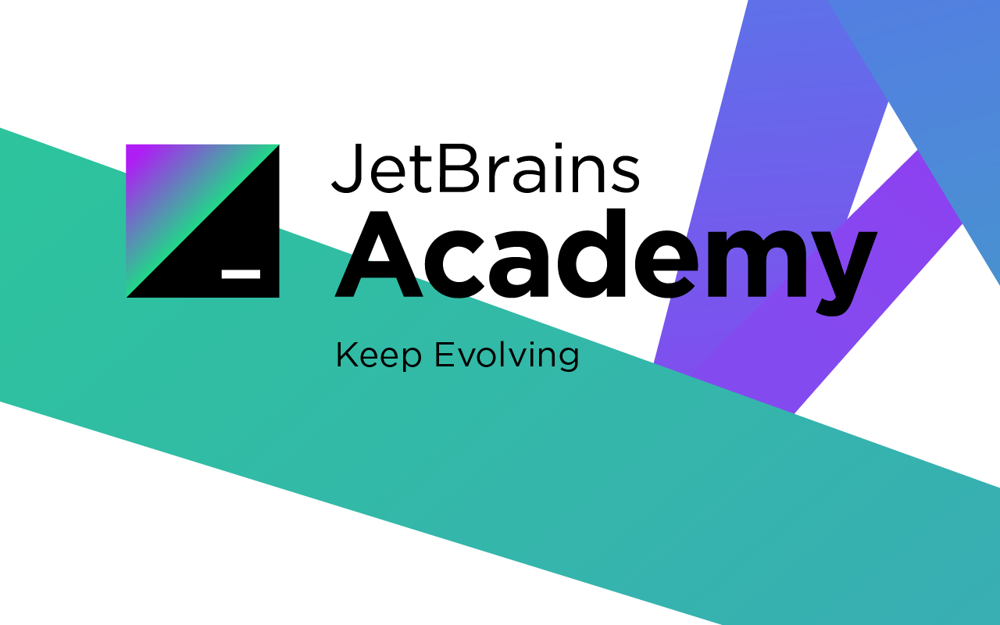

## code-sharing-platform

There is a lot of collaboration in programming:   
many projects require sharing your code with other developers. Using open web resources such as Pastebin is not always an option.  
In this project, you will create your own (somehow but not optimal) secure version of a code-sharing platform.

### OverView

This was a project I studied and worked on via this awesome educational platform 
called [JetBrains Academy](https://hyperskill.org/).  
What's more interesting is that you can access it locally via IntelliJ's 
[EduTools plugin](https://plugins.jetbrains.com/plugin/10081-edutools).   

### Technologies
- Java 11
- gradle
- Spring data JPA
- H2 Database

### Notes
- This project uses an "H2 Database" added on project directory.
- Provided with a [postman.collection](demo.postman_collection.json) file.

## Authors

